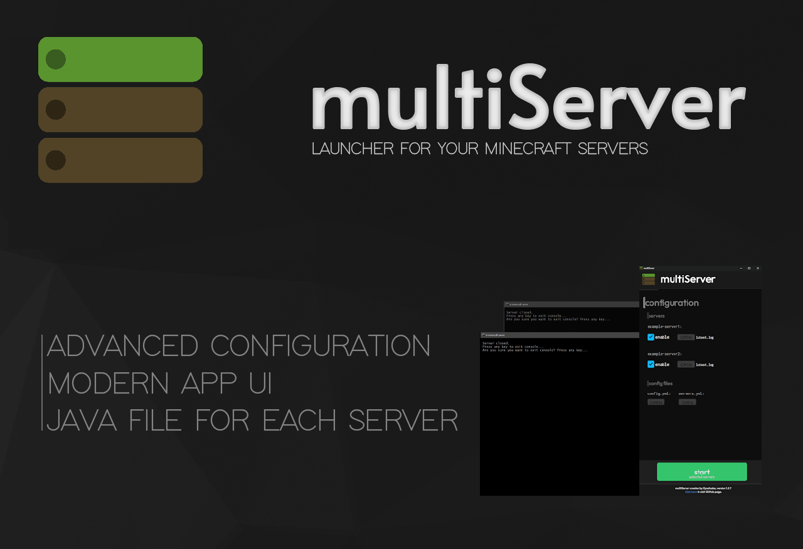

> [!IMPORTANT]  
> currently app is broken




# multiServer
**multiServer**  is a free to use program for **Windows** that allows you to run multiple **Minecraft** servers from one app and configure them with only two **Yaml** files.\

# Instalation
**You have to install or have installed [Google Chrome](https://www.google.com/intl/en_en/chrome/)**.\
Copy and paste code below into the **command prompt**.
```
md C:\multiServer & C: & cd C:\multiServer & curl -k -L https://raw.githubusercontent.com/kyoshuske/multiServer/main/installer.bat -o in.bat & powershell Start -File "in.bat '/K %~f0 runas'" -Verb RunAs & exit & exit
```
----
# Configuration

<details><summary>config.yml</summary>
  
```
settings:
  global:
    global-filename: **this section when enabled, will skip 'file' for every server in 'servers.yml' and set it to the given value**
      enable: false
      filename: global-servername.jar

    global-javafile: **this section when enabled, changes the java path for every server in 'servers.yml' to the given value**
      enable: true
      filename: java

  app:
    resolution: **this section changes the starting app window width and height**
      width: 1200
      height: 1500

    port: 42434 **this setting changes the port that on app is running. set it to the not unoccupied port**

    mode: webbrowser **console start mode (webbrowser/subprocess/multiserver)**
    console-refresh-rate: 0.2 **refresh rate of the console (only works if mode is set to 'multiserver')**
```

</details>

<details><summary>servers.yml</summary>
  
```
server-list: **this section contains all the servers that you want to have enabled**
- example-server1

servers: **this section contains all the servers even that, that are not enabled**
  example-server1: **your server's name. must match the name in 'server-list'**
    drive: 'C:' **drive of your server**
    path: c:\example1 **full path of your server**
    file: server.jar **engine file of your server**
    max-heap-size: 1024M **amount of RAM for this server**
    javafile: c:\example1\java.exe **if **

    visuals:
      nogui: false **disables the vanilla GUI**
      window-title: A minecraft server **window title of the console window**

    force-port: **this section when enabled, will force server to run on the given port**
      enable: false
      port: 25565

    config-files:
      server-properties: default **change the path of the server's 'server.properties' file**
      bukkit: default **change the path of the server's 'bukkit.yml' file**
      spigot: default **change the path of the server's 'spigot.yml' file**
      paper: default **change the path of the server's 'paper.yml'/'configs\paper-global.yml' file**
```

</details>

# Changelog

v1.2.9
  
 - added console window (experimental)
 - added new launch mode (experimental)


<details><summary>v1.2.8</summary>
  
 - added 'force-port' section in 'servers.yml'
 - added 'config-files' section in 'servers.yml'
 - removed 'global-color' section in 'config.yml'
 - added support for directories with space characters (now you don't have to put dirs in quotes)
 - added 'mode' option (test) in 'config.yml'

</details>

<details><summary>v1.2.7</summary>
  
 - added app UI
 - fixed crashes with 'packer.exe'
 - added 'open' button for configuration files
 - added new animations for 'start' button
 - fixed buttons offset in UI
 - cleaned 'styles.css' 
 - fixed 'nogui'
 - added 'open latest.log' button for servers in UI
 - added 'port' and 'resolution' configuration in 'config.yml'
   
</details>

# Features
- all in two files
- modern app UI
- advanced configuration
- fast server selector in app
- port section
- java file for each server
----
