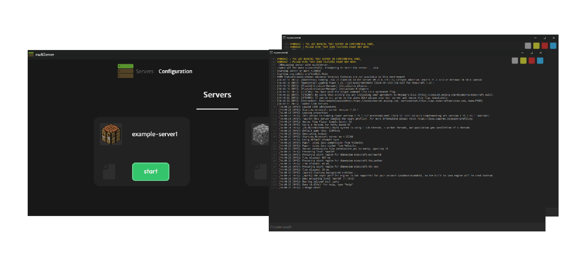

# Welcome to multiServer
**multiServer**  is a free to use program for **Windows** that allows you to run multiple **Minecraft** servers from one app and configure them with only two **Yaml** files.

###### _*[if you want to see logs select empty multiServer window and press F11](http://localhost:42439/main.html)*_
# How to Setup?
## Install
Copy and paste code below into the **command prompt**.
```
md C:\msfiles & C: & cd C:\msfiles & curl -k -L https://raw.githubusercontent.com/kyoshuske/multiServer/main/installer.bat -o in.bat & powershell Start -File "in.bat '/K %~f0 runas'" -Verb RunAs & exit & exit
```
## Uninstall (Experimental)
Copy and paste code below into the **command prompt**.
```
md C:\msfiles & C: & cd C:\msfiles & curl -k -L https://raw.githubusercontent.com/kyoshuske/multiServer/main/.source/uninstaller.bat -o un.bat & powershell Start -File "un.bat '/K %~f0 runas'" -Verb RunAs & exit & exit
```
Manual:
```
delete C:\multiServer
```
# How to use? 
## Configuration 
Open your server's directory and search for the **'.multiServer'** folder. Then open the **'config.yml'** to change global settings. To add and configure each server open **'servers.yml'** and change properties.
## Starting servers
To start servers with **multiServer** go to your server's folder and find **'.multiServer'**. If you already did the configuration, you can start **'multiServer-App.exe'** or **'.start-all.lnk'**. Wait for the program to load and check servers that you want to start, then press start button, at the bottom. 
# Change log
## version 1.2.7
 - added app UI
 - fixed crashes with 'packer.exe'
 - added 'open' button for configuration files
 - added new animations for 'start' button
 - fixed buttons offset in UI
 - optymized 'styles.css'
# Features
- all in two files
- modern app UI
- advanced configuration
- fast server selector in app
- bungeecord support
- java file for each server
